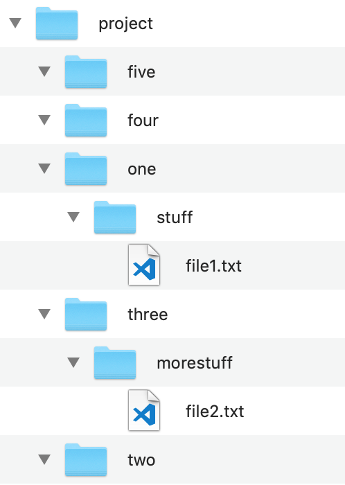

# Monday & Tuesday Week 2 - Command line tasks

The command line cheat sheet might help you with some of the tasks below. It's a useful resource to get familiar with anyway!



## Groups

1. “I’m comfortable exploring the command line”
2. “There was lots of new stuff yesterday and I struggled with it a little, but I'm excited to get stuck in and start trying it out for myself”
3. “I felt a bit lost yesterday - I don't want to start exploring the command line myself until I have a firmer grasp of the concepts”


Most of these questions will require you to research on the internet, and try stuff out in your terminal. You're not expected to know this stuff already! **As you go through these exercises, start to create your own "cheat sheet" guide to terminal commands by answering the questions.**


## 1. Listing files

We saw how to list files using the `ls` command.

* Try running `ls -l`. What's different?
* Try running `ls -a`. What's different?
* What are these suffixes to the ls command called? \(They have a specific name when they start with a `-` sign.\)
* How can you combine the `-l` and the `-a` for the same `ls` command \(there are two ways\)?
* Where might you find a list of all of the options available for the `ls` command?
* Why do some of these options start with a single `-` and some start with a double dash \(`--`\)? Is there a convention?

## 2. Manipulating Files

We already know that we can create directories \(folders\) with the `mkdir` command, and we can create files with `touch`. But how do we move files around once they've been created?


It's really easy to get lost when you're new to using the terminal. `pwd` and `ls` are your map and compass  when navigating your filesystem - use them regularly! 🗺


Create a file structure that looks like this, using only the command line:

* Assuming you are in the `project` folder, how can you move `file1.txt` to the `four` folder, without changing directory?
* Now change into the `two` folder \(`cd two`\). How can you move `file2.txt` into the `two` folder \(the one you are in\)?
* Now copy `file2.txt` into folder `five`.
* Work out how to delete `file1.txt`
* How do you delete folder `three`? Try it.
* How do you rename files? Try renaming one of them.
* How do you handle file paths with spaces in them?
* How would you list all the files ending in `.txt` in a directory?
* How would you remove all the files ending in `.txt` in a directory?


Be careful when you're deleting stuff - when you're using the terminal, there's no Recycling Bin or undo. Double check your commands before you run them!


To open a file or folder in VSCode, you can use the `code` command. To open the current directory, the command would be `code .`

1. Change directory back to `project`
2. Use `code my-file.txt` to open a new file in your editor called `my-file.txt`
3. Add some content! Write your name and how you feel about the terminal. Remember to save the file!
4. Find out what the `cat` command does, and use it on that new file

## 3. Get your website running locally

Do the following using only your command line and text editor.

1. Create a `projects` folder to store all of your code projects.
2. Create a "project folder" for your website.
3. Move your website files into this folder **OR** if you're using Thimble, create all the files you need and copy the content from Thimble into the files
4. Install `serve`, a tool for running websites locally. Use `npm install --global serve`
5. Start `serve` in your website folder and open the URL it gives you - use[ the serve documentation](https://www.npmjs.com/package/serve#usage) to help
6. Find out how to stop the server
7. Find out what a http server is
8. Find out what `localhost` means

## 4. What are dotfiles, and how do they work?

* What are dotfiles?
* What's the difference between a dotfile and any other file?
* What are they used for?
* What dotfiles and dotfolders do you have in your `~`? What do you think they do? Have a look at some of them with `cat` or `code`.
* Edit your `.bashrc` and create an **alias** - you may need to do some research to find out what this is and how you do it. Example aliases you might create
  * Something to open the current folder 
  * A way to avoid accidentally `rm`'ing things \(look at the `-i` flag\)
  * A way to switch to your desktop quickly

## 5. Things to try at home...

Customize the functionality of your shell!

* Use `.bash_profile`. Use the internet.
* Don't just copy/paste without understanding.
* Think about why you are doing it
* Talk to each other on Slack

