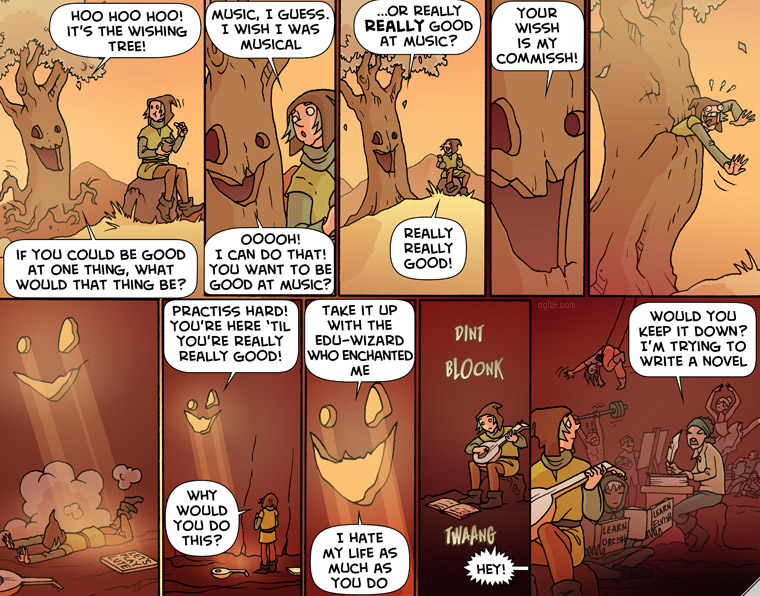

# Week 3: Programming

## Timetable

{% embed data="{\"url\":\"https://airtable.com/shra5dNWVSA29PfmS\",\"type\":\"rich\",\"title\":\"Cohort 4 Student Timetable \(Week 3\) - Airtable\",\"description\":\"Explore the \\\"Cohort 4 Student Timetable \(Week 3\)\\\" view on Airtable.\",\"icon\":{\"type\":\"icon\",\"url\":\"https://airtable.com/images/favicon/baymax/apple-touch-icon.png\",\"width\":180,\"height\":180,\"aspectRatio\":1},\"thumbnail\":{\"type\":\"thumbnail\",\"url\":\"https://static.airtable.com/images/oembed/airtable.png\",\"width\":1200,\"height\":630,\"aspectRatio\":0.525},\"embed\":{\"type\":\"reader\",\"url\":\"https://airtable.com/embed/shra5dNWVSA29PfmS\",\"html\":\"<iframe src=\\\"https://airtable.com/embed/shra5dNWVSA29PfmS\\\" style=\\\"border: 0; width: 100%; height: 533px;\\\" allowfullscreen></iframe>\",\"height\":533,\"aspectRatio\":null}}" %}

## Introduction

Welcome to Programming! The next 4 weeks or so are going to be pretty code-intensive. Programming, like a lot of skills, is something that can be pretty hard to learn. Really, the only way to learn to code is by doing it a whole lot. There are some great books articles and videos out there, which can be good as supporting material and to help you understand and contextualise what you're learning. Nothing beats writing code though. Chances are, if you're not writing code, you're not learning to code.

Each day this week, you'll have some facilitated lecture and interactive workshop time. The majority of your time is going to be spent writing code though. You'll work in pairs, changing partners frequently, on a series of self-directed workshops designed to expose you to all the basics. There's also 3 suggested Code Wars katas for each day after Wednesday. You need to complete at least one of these each day in your own time.

Our goal isn't to have you be expert programmers by the end of the launchpad, memorise everything we cover, or even fully understand a lot of the concepts we talk about - there's no substitute for time & practice for those things. Instead, we want you to know what's possible. We want you to have the skills to ask the right questions, then find answers to those questions on your own.

As part of that, you might find we don't always answer your questions in the way you like. This can be pretty frustrating, but we'll always try and be supportive. Our aim is to help you discover the answer on your own. If you're interested in how we approach that sort of thing, you might want to read the coach guide!



## Day 1: Intro to Programming

### Slides

[https://docs.google.com/presentation/d/1bsfKttSOLUl7sYtNaKgAmYFinuHqHTHv3\_fca0vNnL8/edit?usp=sharing](https://docs.google.com/presentation/d/1bsfKttSOLUl7sYtNaKgAmYFinuHqHTHv3_fca0vNnL8/edit?usp=sharing)

### Workshop

{% embed data="{\"url\":\"https://github.com/adaapp/di-workshop-01-intro-to-p5\",\"type\":\"link\",\"title\":\"adaapp/di-workshop-01-intro-to-p5\",\"description\":\"Introducing JavaScript with P5.js. Contribute to adaapp/di-workshop-01-intro-to-p5 development by creating an account on GitHub.\",\"icon\":{\"type\":\"icon\",\"url\":\"https://github.com/fluidicon.png\",\"aspectRatio\":0},\"thumbnail\":{\"type\":\"thumbnail\",\"url\":\"https://avatars1.githubusercontent.com/u/42465401?s=400&v=4\",\"width\":400,\"height\":400,\"aspectRatio\":1}}" %}

### Notes

Help out by filling out this section!

## Day 2: Variables, Data Types, Decisions

### Slides

[https://docs.google.com/presentation/d/1n8wFJhCQF-ytMsDWgkEamVZFlxkdit3An6S1k8FCk4g/edit?usp=sharing](https://docs.google.com/presentation/d/1n8wFJhCQF-ytMsDWgkEamVZFlxkdit3An6S1k8FCk4g/edit?usp=sharing)

### Workshop

{% embed data="{\"url\":\"https://github.com/adaapp/di-workshop-02-variables-datatypes-decisions\",\"type\":\"link\",\"title\":\"adaapp/di-workshop-02-variables-datatypes-decisions\",\"description\":\"Variables, Data Types, Decisions. Contribute to adaapp/di-workshop-02-variables-datatypes-decisions development by creating an account on GitHub.\",\"icon\":{\"type\":\"icon\",\"url\":\"https://github.com/fluidicon.png\",\"aspectRatio\":0},\"thumbnail\":{\"type\":\"thumbnail\",\"url\":\"https://avatars1.githubusercontent.com/u/42465401?s=400&v=4\",\"width\":400,\"height\":400,\"aspectRatio\":1}}" %}

### Notes

Help out by filling out this section!

## Day 3: Functions

### Slides

[https://docs.google.com/presentation/d/1q7IxhaUpx-XeKwrXRHb1l0n\_jlbdOVCaSt0IRvbGhSM/edit?usp=sharing](https://docs.google.com/presentation/d/1q7IxhaUpx-XeKwrXRHb1l0n_jlbdOVCaSt0IRvbGhSM/edit?usp=sharing)

### Workshop

{% embed data="{\"url\":\"https://github.com/adaapp/di-workshop-03-functions\",\"type\":\"link\",\"title\":\"adaapp/di-workshop-03-functions\",\"description\":\"Functions. Contribute to adaapp/di-workshop-03-functions development by creating an account on GitHub.\",\"icon\":{\"type\":\"icon\",\"url\":\"https://github.com/fluidicon.png\",\"aspectRatio\":0},\"thumbnail\":{\"type\":\"thumbnail\",\"url\":\"https://avatars1.githubusercontent.com/u/42465401?s=400&v=4\",\"width\":400,\"height\":400,\"aspectRatio\":1}}" %}

### Notes

Help out by filling out this section!

### Katas

Sign up for Code Wars with your GitHub account.

{% embed data="{\"url\":\"http://www.codewars.com/\",\"type\":\"link\",\"title\":\"Codewars: Train your coding skills\",\"description\":\"Codewars is where developers achieve code mastery through challenge. Train on kata in the dojo and reach your highest potential.\",\"icon\":{\"type\":\"icon\",\"url\":\"https://www.codewars.com/favicon.ico\",\"aspectRatio\":0},\"thumbnail\":{\"type\":\"thumbnail\",\"url\":\"//www.codewars.com/assets/logos/logo-square-paper-bg.jpg\",\"width\":200,\"height\":200,\"aspectRatio\":1}}" %}

Complete at least one of the following three Katas in your own time:

{% embed data="{\"url\":\"https://www.codewars.com/kata/century-from-year\",\"type\":\"link\",\"title\":\"Century From Year\",\"description\":\"Codewars is where developers achieve code mastery through challenge. Train on kata in the dojo and reach your highest potential.\",\"icon\":{\"type\":\"icon\",\"url\":\"https://www.codewars.com/favicon.ico\",\"aspectRatio\":0},\"thumbnail\":{\"type\":\"thumbnail\",\"url\":\"//www.codewars.com/assets/logos/logo-square-paper-bg.jpg\",\"width\":200,\"height\":200,\"aspectRatio\":1}}" %}

{% embed data="{\"url\":\"https://www.codewars.com/kata/thinkful-logic-drills-traffic-light\",\"type\":\"link\",\"title\":\"Thinkful - Logic Drills: Traffic light\",\"description\":\"Codewars is where developers achieve code mastery through challenge. Train on kata in the dojo and reach your highest potential.\",\"icon\":{\"type\":\"icon\",\"url\":\"https://www.codewars.com/favicon.ico\",\"aspectRatio\":0},\"thumbnail\":{\"type\":\"thumbnail\",\"url\":\"//www.codewars.com/assets/logos/logo-square-paper-bg.jpg\",\"width\":200,\"height\":200,\"aspectRatio\":1}}" %}

{% embed data="{\"url\":\"https://www.codewars.com/kata/thinkful-logic-drills-umbrella-decider\",\"type\":\"link\",\"title\":\"Thinkful - Logic Drills: Umbrella decider\",\"description\":\"Codewars is where developers achieve code mastery through challenge. Train on kata in the dojo and reach your highest potential.\",\"icon\":{\"type\":\"icon\",\"url\":\"https://www.codewars.com/favicon.ico\",\"aspectRatio\":0},\"thumbnail\":{\"type\":\"thumbnail\",\"url\":\"//www.codewars.com/assets/logos/logo-square-paper-bg.jpg\",\"width\":200,\"height\":200,\"aspectRatio\":1}}" %}

## Day 4: Arrays

### Slides

TODO

### Workshop

{% embed data="{\"url\":\"https://github.com/adaapp/di-workshop-04-arrays-loops\",\"type\":\"link\",\"title\":\"adaapp/di-workshop-04-arrays-loops\",\"description\":\"Arrays & loops. Contribute to adaapp/di-workshop-04-arrays-loops development by creating an account on GitHub.\",\"icon\":{\"type\":\"icon\",\"url\":\"https://github.com/fluidicon.png\",\"aspectRatio\":0},\"thumbnail\":{\"type\":\"thumbnail\",\"url\":\"https://avatars1.githubusercontent.com/u/42465401?s=400&v=4\",\"width\":400,\"height\":400,\"aspectRatio\":1}}" %}

### Notes

Help out by filling out this section!

### Katas

Complete at least one of the following three Katas in your own time:

{% embed data="{\"url\":\"https://www.codewars.com/kata/string-repeat\",\"type\":\"link\",\"title\":\"String repeat\",\"description\":\"Codewars is where developers achieve code mastery through challenge. Train on kata in the dojo and reach your highest potential.\",\"icon\":{\"type\":\"icon\",\"url\":\"https://www.codewars.com/favicon.ico\",\"aspectRatio\":0},\"thumbnail\":{\"type\":\"thumbnail\",\"url\":\"//www.codewars.com/assets/logos/logo-square-paper-bg.jpg\",\"width\":200,\"height\":200,\"aspectRatio\":1}}" %}

{% embed data="{\"url\":\"https://www.codewars.com/kata/thinkful-list-drills-longest-word\",\"type\":\"link\",\"title\":\"Thinkful - List Drills: Longest word\",\"description\":\"Codewars is where developers achieve code mastery through challenge. Train on kata in the dojo and reach your highest potential.\",\"icon\":{\"type\":\"icon\",\"url\":\"https://www.codewars.com/favicon.ico\",\"aspectRatio\":0},\"thumbnail\":{\"type\":\"thumbnail\",\"url\":\"//www.codewars.com/assets/logos/logo-square-paper-bg.jpg\",\"width\":200,\"height\":200,\"aspectRatio\":1}}" %}

{% embed data="{\"url\":\"https://www.codewars.com/kata/sum-of-differences-in-array\",\"type\":\"link\",\"title\":\"Sum of differences in array\",\"description\":\"Codewars is where developers achieve code mastery through challenge. Train on kata in the dojo and reach your highest potential.\",\"icon\":{\"type\":\"icon\",\"url\":\"https://www.codewars.com/favicon.ico\",\"aspectRatio\":0},\"thumbnail\":{\"type\":\"thumbnail\",\"url\":\"//www.codewars.com/assets/logos/logo-square-paper-bg.jpg\",\"width\":200,\"height\":200,\"aspectRatio\":1}}" %}

## Day 5: Objects

### Slides

TODO

### Workshop

TODO

### Notes

Help out by filling out this section!

### Katas

Complete at least one of the following three Katas in your own time:

