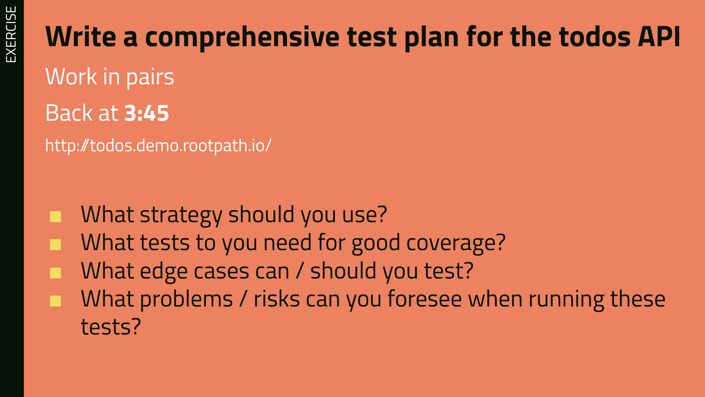
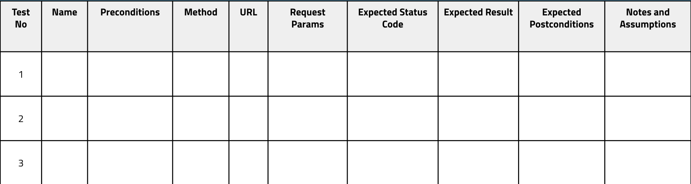

# Week 6: Testing

## Day 1: Intro to Testing & Hotels App

### Slides



### Workshop



## Day 2: Test Levels and APIs

[Test Levels Slides](https://docs.google.com/presentation/d/1TiUW0qy6hPvfrTGDYDjm8LE44ir7GamifqxjbaU1SgE/edit?usp=sharing)

[Introduction to Web APIs Slides](https://docs.google.com/presentation/d/10zFGq66KeFtLtLiZnf_niflAwLewhuZ9BkpKOJjuYyg/edit?usp=sharing)

### Workshop

## Day 3: Async JS & Automated API Tests

### Workshop:



### Screencast:



